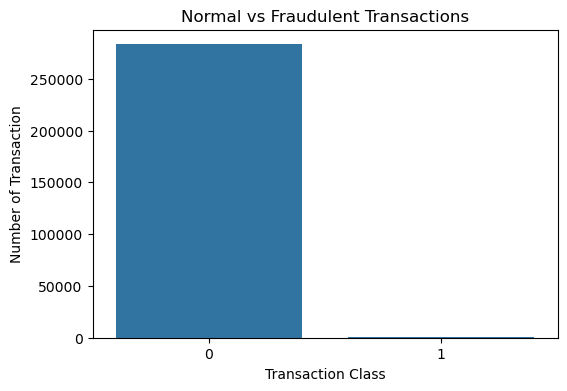
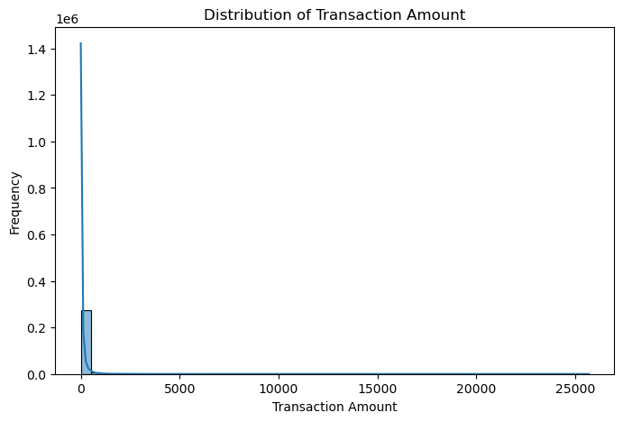
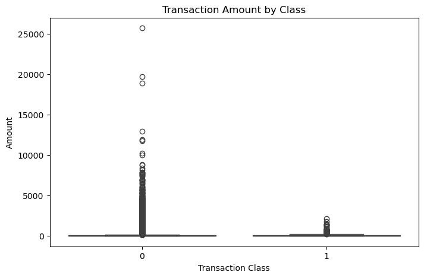
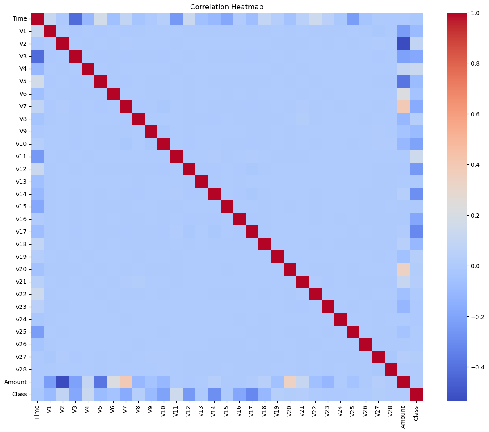
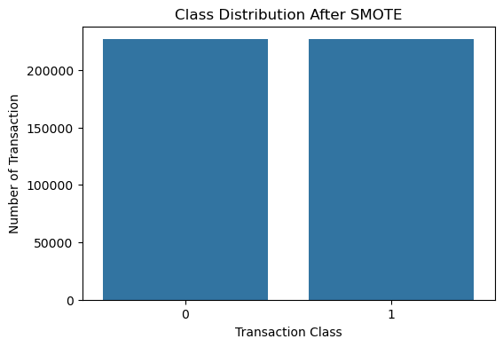
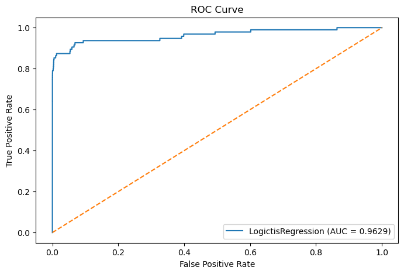

# Credit Card Fraud Detection

## 📌 Project Overview

Credit card fraud detection is a classification problem where the goal is to identify fraudulent transactions from a large number of legitimate transactions.

This project uses **Exploratory Data Analysis, SMOTE, Feature Scaling, and Logistic Regression** to detect potentially fraudulent credit card transactions.

The project follows an end-to-end Machine Learning workflow, including data cleaning, class imbalance handling, model building, evaluation, and feature analysis.

## 🎯 Objectives

- Analyze credit card transaction data
- Identify fraudulent and legitimate transactions
- Clean and prepare the dataset
- Perform Exploratory Data Analysis (EDA)
- Handle severe class imbalance using SMOTE
- Scale numerical features using StandardScaler
- Build a Logistic Regression classification model
- Evaluate model performance using multiple metrics
- Analyze model coefficients and feature importance

## 📊 Dataset

The dataset contains **284,807 credit card transactions** with **31 columns**.

It includes:

- `Time` — Time elapsed between transactions
- `V1` to `V28` — Anonymized numerical features
- `Amount` — Transaction amount
- `Class` — Target variable

Target classes:

- `0` → Normal transaction
- `1` → Fraudulent transaction

### Class Distribution

Before data cleaning:

- Normal transactions: **284,315**
- Fraudulent transactions: **492**

After removing duplicate records:

- Normal transactions: **283,253**
- Fraudulent transactions: **473**

The dataset is highly imbalanced, with fraudulent transactions representing approximately **0.17%** of the cleaned dataset.

## 🛠️ Technologies Used

- Python
- Pandas
- NumPy
- Matplotlib
- Seaborn
- Scikit-learn
- Imbalanced-learn
- Jupyter Notebook

## 🔄 Project Workflow

1. Import Libraries
2. Load Dataset
3. Understand Dataset Structure
4. Check Data Types
5. Check Missing Values
6. Check Duplicate Records
7. Generate Statistical Summary
8. Analyze Target Variable
9. Remove Duplicate Records
10. Exploratory Data Analysis
11. Correlation Analysis
12. Separate Features and Target
13. Train-Test Split
14. Handle Class Imbalance using SMOTE
15. Feature Scaling using StandardScaler
16. Build Logistic Regression Model
17. Generate Predictions
18. Evaluate Model
19. Analyze Confusion Matrix
20. Calculate ROC-AUC
21. Analyze Feature Coefficients

## 🧹 Data Cleaning

The dataset was checked for:

- Missing values
- Duplicate records
- Data types
- Infinite values
- Target class distribution

### Cleaning Results

- Duplicate records identified: **1,081**
- Missing values after cleaning: **0**
- Infinite numerical values: **0**
- Final dataset: **283,726 rows × 31 columns**

## 📈 Exploratory Data Analysis

EDA was performed to understand transaction patterns and differences between normal and fraudulent transactions.

The analysis included:

- Normal vs fraudulent transaction distribution
- Transaction amount distribution
- Transaction amount comparison by class
- Transaction time analysis
- Correlation analysis
- Correlation heatmap

## ⚖️ Handling Class Imbalance

The dataset contains significantly fewer fraudulent transactions than normal transactions.

To address this imbalance, **SMOTE (Synthetic Minority Over-sampling Technique)** was applied only to the training data.

### Before SMOTE

- Normal: **226,602**
- Fraud: **378**

### After SMOTE

- Normal: **226,602**
- Fraud: **226,602**

This created a balanced training dataset while keeping the original test data unchanged.

## 📏 Feature Scaling

`StandardScaler` was used to scale the features before training the Logistic Regression model.

Training data after scaling:

**453,204 × 30**

Testing data after scaling:

**56,746 × 30**

## 🤖 Machine Learning Model

### Logistic Regression

A **Logistic Regression** classification model was trained using the balanced and scaled training data.

The model was then used to predict fraudulent and normal transactions in the test dataset.

## 📊 Model Performance

The model was evaluated using Accuracy, Precision, Recall, F1-Score, and ROC-AUC.

| Metric | Score |
|---|---:|
| Accuracy | 99.12% |
| Precision | 14.24% |
| Recall | 85.26% |
| F1-Score | 24.40% |
| ROC-AUC | 0.963 |

Because the dataset is highly imbalanced, multiple evaluation metrics were considered instead of relying on accuracy alone.

## 🔲 Confusion Matrix

The confusion matrix produced the following results:

| | Predicted Normal | Predicted Fraud |
|---|---:|---:|
| Actual Normal | 56,163 | 488 |
| Actual Fraud | 14 | 81 |

The model correctly identified **81 fraudulent transactions** and missed **14 fraudulent transactions** in the test set.

## 📈 ROC Curve & AUC

The model achieved a **ROC-AUC score of 0.963**.

The ROC curve was used to evaluate the model's ability to distinguish between normal and fraudulent transactions across different classification thresholds.

## ⭐ Feature Analysis

Logistic Regression coefficients were analyzed to understand the contribution of individual features to the classification model.

The analysis included:

- Positive feature coefficients
- Negative feature coefficients
- Absolute coefficient values
- Feature importance visualization

Some of the stronger coefficients in the notebook include features such as **V14, V17, V12, V10, V1, and V5**.

## 📸 Project Screenshots

### Fraud vs Normal Transactions

### Transaction Amount Distribution

### Transaction Amount by Class

### Correlation Heatmap

### Balanced Data After SMOTE

### Confusion Matrix

.png)

### ROC Curve

### Feature Importance

.png)

## 💡 Key Takeaways

- The dataset contains a very strong class imbalance.
- Duplicate records were removed before modeling.
- SMOTE was applied to the training data to balance the classes.
- StandardScaler was used before Logistic Regression.
- The model achieved **99.12% accuracy** and **85.26% recall** for fraudulent transactions.
- The ROC-AUC score was **0.963**.
- Confusion matrix analysis provided a detailed view of correctly and incorrectly classified transactions.

## 🚀 Business Applications

A fraud detection system can support businesses by:

- Detecting potentially fraudulent transactions
- Supporting transaction monitoring
- Prioritizing suspicious transactions for review
- Reducing potential financial losses
- Supporting automated fraud-risk screening

## 📝 Conclusion

This project demonstrates an end-to-end Machine Learning approach for credit card fraud detection.

The workflow covers data exploration, cleaning, class imbalance handling with SMOTE, feature scaling, Logistic Regression, model evaluation, confusion matrix analysis, ROC-AUC analysis, and feature coefficient analysis.

The project demonstrates how Machine Learning techniques can be applied to highly imbalanced transaction data to identify potentially fraudulent transactions.

## 👩‍💻 Author

**Shabeena Bano**

Aspiring Data Scientist | Python | SQL | Statistics | Machine Learning

GitHub: [shabeenabano](https://github.com/shabeenabano)
